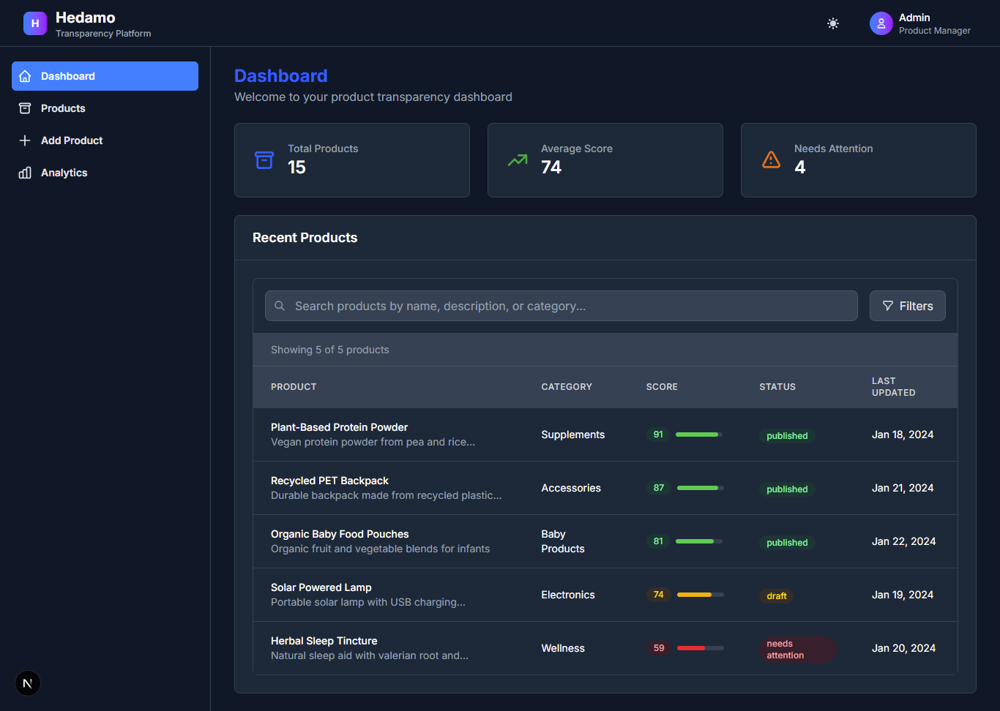
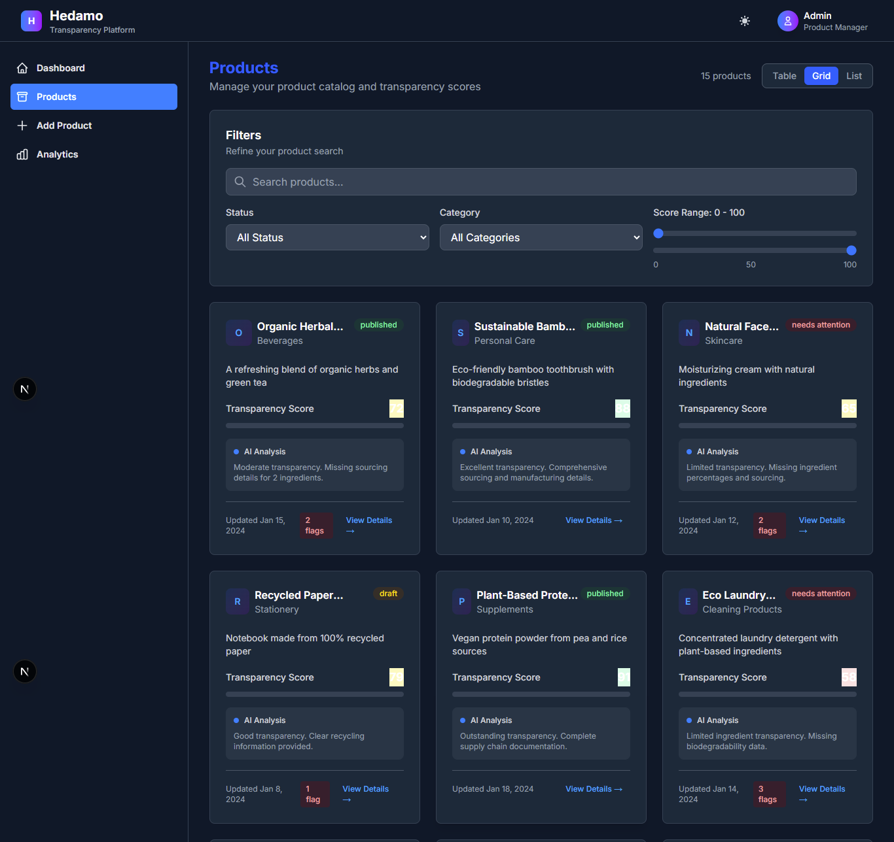
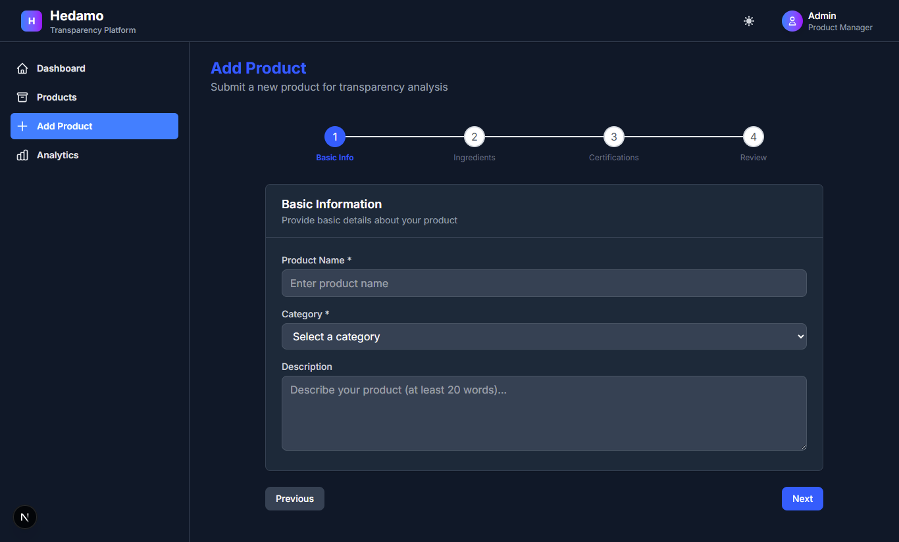
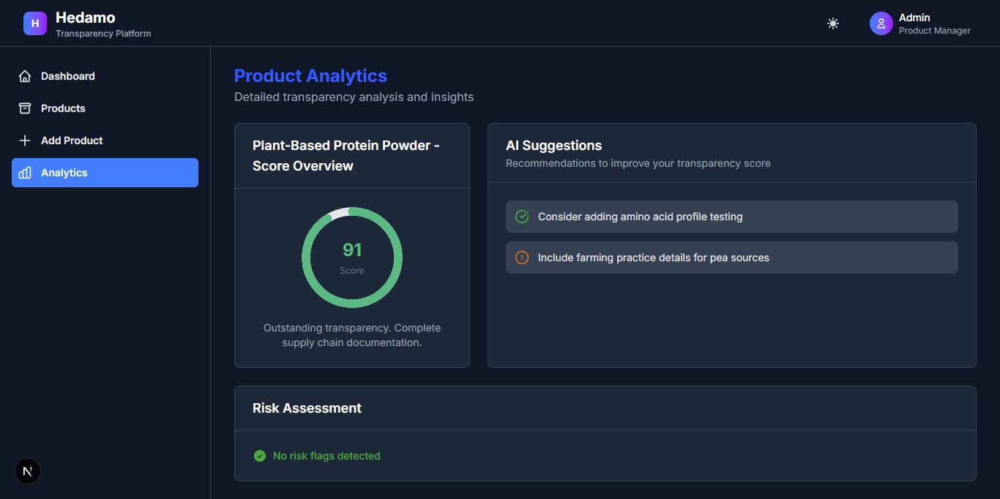

# hedamo-transparency-dashboard
Hedamo Dashboard helps organizations maintain transparency in product composition, certifications, and compliance through AI-driven insights and real-time analytics.built with **Next.js**, **React**, and **Tailwind CSS**.


---

## Features

- 📊 **Dashboard Overview** – Key metrics and recent products  
- 📦 **Product Management** – Browse and manage products with advanced filtering  
- ➕ **Multi-step Product Submission** – Wizard-style form with AI feedback  
- 🎯 **AI-Powered Analytics** – Transparency scores and suggestions  
- 🌙 **Dark Mode** – Toggle between light and dark themes  
- 📱 **Responsive Design** – Optimized for all devices  
- 🎨 **Smooth Animations** – Enhanced UX with Framer Motion  


## 🚀 Advanced Features
- 🌙 Dark Mode - Toggle between light and dark themes

- ⚡ Smooth Animations - Enhanced UX with Framer Motion

- 📈 Data Visualization - Interactive charts and progress indicators

- 🔍 Advanced Search - Real-time product filtering and search

- 📱 Mobile-First - Optimized for mobile and tablet devices
---

## Tech Stack

- **Framework**: Next.js 14 with App Router  
- **Language**: TypeScript  
- **Styling**: Tailwind CSS  
- **Animations**: Framer Motion  
- **Charts**: Recharts  
- **Icons**: Lucide React  

---

## 🖼️ Preview






## Getting Started

1. **Install dependencies**:

```bash
# Install dependencies
npm install

# Run the development server
npm run dev

Then add:
Open your browser and navigate to http://localhost:3000

```


## 🎯 Core Features

### Dashboard Overview
- Real-time Metrics: Total products, average transparency score, attention-needed items

- Recent Products: Quick access to recently updated products

- Performance Insights: Visual score distribution and trends

### Product Management
- Advanced Filtering: Filter by status, category, score range

- Smart Sorting: Sort by name, score, last updated

- Bulk Actions: Multi-select operations for efficiency

- Search Functionality: Real-time product search

- Multi-step Product Submission
- Basic Information - Product name, category, description

### Ingredients - Ingredient list with percentages and sourcing

- Certifications - Quality and sustainability certifications

- Review & Submit - Final review before AI analysis

### AI-Powered Analytics
- Transparency Scoring: 0-100 score based on comprehensive analysis

- Smart Suggestions: Actionable recommendations for improvement

- Risk Assessment: Flag potential issues and compliance gaps

- Progress Tracking: Monitor improvement over time

### Visualization Components
- Radial Progress Gauges: Animated score visualization

- Suggestion Display: Icon-enhanced recommendations

- Risk Flag Management: Severity-coded badges and tags
